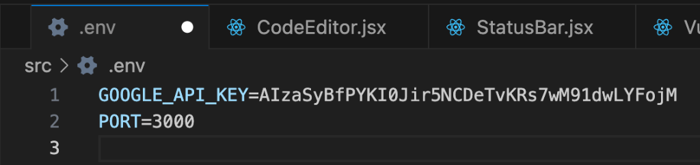

#  SafeSnippet Analyzer — Hands-On Lab Guide

> **Building Reliable AI Workflows with Node.js, Google Gemini & Inngest**
> A professional training lab manual for developers learning production-grade async AI architecture.

---

## Table of Contents

1. [Introduction](#1-introduction)
2. [Prerequisites](#2-prerequisites)
3. [Project Setup](#3-project-setup)
4. [Architecture Deep Dive](#4-architecture-deep-dive)
5. [Phase 1 — The Inngest Client](#5-phase-1--the-inngest-client)
6. [Phase 2 — The In-Memory Results Store](#6-phase-2--the-in-memory-results-store)
7. [Phase 3 — Prompt Engineering & the Gemini Service](#7-phase-3--prompt-engineering--the-gemini-service)
8. [Phase 4 — Defensive JSON Parsing](#8-phase-4--defensive-json-parsing)
9. [Phase 5 — The Durable Inngest Workflow Function](#9-phase-5--the-durable-inngest-workflow-function)
10. [Phase 6 — The Express API Server](#10-phase-6--the-express-api-server)
11. [Phase 7 — The React Frontend](#11-phase-7--the-react-frontend)
12. [Running the Application](#12-running-the-application)
13. [Verification & Testing](#13-verification--testing)
14. [Conceptual Deep Dives](#14-conceptual-deep-dives)
15. [Troubleshooting](#15-troubleshooting)
16. [Best Practices & Engineering Takeaways](#16-best-practices--engineering-takeaways)

---

## 1. Introduction

### What Is SafeSnippet Analyzer?

SafeSnippet Analyzer is an **AI-powered code security analysis tool** that accepts any code snippet (JavaScript, Python, Java, PHP, Go, or TypeScript) and returns a structured vulnerability report identifying OWASP Top 10 issues, injection attacks, hardcoded credentials, and dozens of other security flaws — all powered by Google's Gemini 2.0 Flash model.

What makes this project architecturally significant is **not just the AI integration** — it's how the AI call is orchestrated. A naive implementation would make the Gemini API call directly inside an HTTP request handler. This lab teaches you why that approach fails in production, and how to build a **durable, event-driven, retry-safe async workflow** using Inngest.

### What You Will Build

By the end of this lab, you will have a fully functional, two-process application:

| Component | Technology | Responsibility |
|-----------|-----------|----------------|
| **Express API Server** | Node.js + Express | Accept code via HTTP, return job IDs, serve results |
| **Inngest Workflow Engine** | Inngest Dev Server | Orchestrate background AI analysis with retries |
| **Gemini Integration** | Google Gemini 2.0 Flash | Perform the actual AI-powered code analysis |
| **Results Store** | In-memory Map | Track job state across async boundaries |
| **React Frontend** | Vite + React 19 | Beautiful UI with polling-based result display |

### Key Learning Outcomes

After completing this lab, you will be able to:

- **Explain** why long-running AI tasks must not block HTTP request handlers
- **Design** event-driven async workflows using Inngest's `step.run()` primitives
- **Implement** durable execution with automatic retries and step memoization
- **Engineer** effective prompts for structured JSON output from LLMs
- **Build** defensive parsers that handle unpredictable LLM responses
- **Apply** the polling pattern for async job status tracking
-  **Understand** the tradeoffs between in-memory storage and persistent databases

---

## 2. Prerequisites

### Required Software

| Tool | Version | How to Check | Install |
|------|---------|-------------|---------|
| **Node.js** | v18+ (v20 recommended) | `node --version` | [nodejs.org](https://nodejs.org) |
| **npm** | v9+ | `npm --version` | Bundled with Node.js |
| **Git** | Any recent | `git --version` | [git-scm.com](https://git-scm.com) |
| **curl** | Any | `curl --version` | Pre-installed on macOS/Linux |

> **Why Node.js v18+?** The `fetch()` API used in `test/testAnalysis.js` was added to Node.js as a stable global in v18. Using an older version will cause a `ReferenceError: fetch is not defined` error.

### Required Accounts & API Keys

**Google Gemini API Key** — Free tier is sufficient for this lab.

1. Visit [https://ai.google.dev/gemini-api/docs/api-key](https://ai.google.dev/gemini-api/docs/api-key)
2. Sign in with a Google account
3. Click **"Get API Key"** → **"Create API Key"**
4. Copy the key (starts with `AIza...`) — you'll need it in the setup step

> **Free tier limits:** 15 requests per minute (RPM), 1 million tokens per day. More than enough for this lab.

> **⚠ Keep your API key secret.** Never commit it to version control. The `.gitignore` in this project excludes `.env` files to protect you.

### No Inngest Account Needed

Inngest provides a local **Dev Server** — a fully self-contained binary that runs on your machine during development. You do **not** need to create an account or configure cloud credentials for this lab.

### Expected Knowledge Level

This lab assumes you are comfortable with:
- JavaScript (ES2020+), including `async/await` and Promises
- Basic Node.js modules (`require`, `module.exports`)
- HTTP concepts (request/response, status codes, JSON)
- Basic React concepts (components, `useState`, `useEffect`)
- Running terminal commands

You do **not** need prior experience with Inngest, LLM APIs, or workflow orchestration.

---

## 3. Project Setup

### Step 1 — Examine the Repository Structure

Before installing anything, understand what you're working with.

```
SafeSnippet Analyzer/
├── src/                          ← Backend (Node.js + Express + Inngest)
│   ├── server.js                 ← Entry point: API routes + Inngest middleware
│   ├── inngest/
│   │   ├── client.js             ← Shared Inngest client (singleton)
│   │   └── analyzeCode.js        ← Durable 3-step workflow function
│   ├── services/
│   │   └── geminiService.js      ← Google Gemini API integration layer
│   ├── prompts/
│   │   └── securityAnalysis.js   ← System prompt + few-shot example templates
│   ├── utils/
│   │   └── jsonParser.js         ← Defensive LLM JSON output parser
│   ├── store/
│   │   └── resultsStore.js       ← In-memory job state store (Map)
│   ├── test/
│   │   └── testAnalysis.js       ← End-to-end integration test script
│   ├── .env.example              ← Environment variable template
│   └── package.json              ← Backend dependencies
│
└── frontend/                     ← Frontend (Vite + React 19)
    ├── src/
    │   ├── App.jsx               ← Root component with polling logic
    │   ├── index.css             ← Design system (CSS variables, glassmorphism)
    │   ├── main.jsx              ← React entry point
    │   └── components/
    │       ├── CodeEditor.jsx    ← Textarea + language selector
    │       ├── StatusBar.jsx     ← Job status indicator with icons
    │       └── VulnerabilityCard.jsx ← Individual vulnerability display
    ├── vite.config.js            ← Dev server with /api proxy to port 3000
    └── package.json              ← Frontend dependencies
```


**Why two separate directories?** The `src/` folder is the backend — a Node.js process running 24/7. The `frontend/` folder is a separate Vite development server that serves the React UI. In development, both run simultaneously. In production, the frontend would be built and served as static files from the Express server's `/public` directory.

### Step 2 — Install Backend Dependencies

```bash
cd "SafeSnippet Analyzer/src"
npm install
```

This reads `package.json` and installs five production dependencies:

| Package | Version | Purpose |
|---------|---------|---------|
| `@google/generative-ai` | ^0.24.0 | Official Google Gemini SDK |
| `dotenv` | ^16.5.0 | Loads `.env` file into `process.env` |
| `express` | ^4.21.0 | HTTP server framework |
| `inngest` | ^3.31.0 | Workflow orchestration SDK + Express middleware |
| `uuid` | ^11.1.0 | Generates UUID v4 job IDs |


> **Why no test framework like Jest?** The lab uses a manual integration test script (`test/testAnalysis.js`) instead of unit tests. This keeps the setup simple while still exercising the full request→queue→process→poll flow.

### Step 3 — Install Frontend Dependencies

```bash
cd ../frontend
npm install
```

This installs the React 19 ecosystem with Vite as the build tool and `lucide-react` for icons.

### Step 4 — Configure Environment Variables

```bash
# Navigate back to the backend directory
cd ../src

# Copy the template
cp .env.example .env
```

Now open `.env` in your editor. You'll see:

```env
# Google Gemini API Key
GOOGLE_API_KEY=your_gemini_api_key_here

# Server Configuration
PORT=3000

# Inngest Configuration (optional — defaults work for local development)
# INNGEST_EVENT_KEY=local
# INNGEST_SIGNING_KEY=local
```

Replace `your_gemini_api_key_here` with the API key you obtained in Step 2 of the prerequisites.

**Why does `dotenv` need to be the first line in `server.js`?**

Look at line 38 of `server.js`:
```javascript
require("dotenv").config();  // ← This is the VERY FIRST line of application code
```

`dotenv` reads the `.env` file and populates `process.env` with its key-value pairs. If any module that reads `process.env.GOOGLE_API_KEY` is imported *before* `dotenv.config()` runs, it will see `undefined`. The `geminiService.js` reads `process.env.GOOGLE_API_KEY` at module load time (line 36), so `dotenv` must initialize first.



### Step 5 — Verify Setup

Start the backend server:

```bash
# You should be in the src/ directory
npm run dev
```

You should see a banner like this in your terminal:

```
╔══════════════════════════════════════════════════════════════╗
║                                                              ║
║     SafeSnippet Analyzer — Server Running                  ║
║                                                              ║
║   Local:    http://localhost:3000                            ║
║   Health:   http://localhost:3000/api/health                 ║
║   Inngest:  http://localhost:3000/api/inngest                ║
║                                                              ║
║   Gemini API Key:  Configured                              ║
║                                                              ╚══════════════════════════════════════════════════════════════╝
```

> If you see ` MISSING — check .env` next to the Gemini API Key, go back and verify your `.env` file.

Test the health endpoint:

```bash
curl http://localhost:3000/api/health
```

Expected response:
```json
{
  "status": "healthy",
  "service": "SafeSnippet Analyzer",
  "timestamp": "2025-01-15T10:30:00.000Z",
  "geminiConfigured": true
}
```


---

## 4. Architecture Deep Dive

Before diving into individual files, understand the **complete request lifecycle**:

```
┌─────────────────────────────────────────────────────────────────────────┐
│                      COMPLETE REQUEST LIFECYCLE                          │
│                                                                         │
│  1. User submits code                                                   │
│     Browser → POST /api/analyze → Express                              │
│                                                                         │
│  2. Express generates jobId, creates "pending" job in resultsStore      │
│     Fires event "code/analyze.requested" to Inngest                    │
│     Returns HTTP 202 with jobId  (< 50ms)                              │
│                                                                         │
│  3. Inngest Dev Server receives event, routes to analyzeCodeFunction    │
│                                                                         │
│  4. analyzeCodeFunction runs 3 durable steps:                           │
│     Step 1: markProcessing(jobId)   → updates store                    │
│     Step 2: analyzeCodeWithAI()     → calls Gemini API (3-15 seconds)  │
│     Step 3: markCompleted(jobId)    → stores result                    │
│                                                                         │
│  5. Meanwhile, frontend polls GET /api/results/:jobId every 2 seconds  │
│     pending → processing → completed                                   │
│                                                                         │
│  6. When status === "completed", frontend renders the report            │
└─────────────────────────────────────────────────────────────────────────┘
```

**Why this architecture and not a simple synchronous call?**

| Naive Approach | Problem | This Architecture | Solution |
|----------------|---------|------------------|---------|
| Call Gemini inside the HTTP handler | Request hangs for 3–15 seconds, browsers timeout at 30s | Fire event, return 202 immediately | < 50ms response time |
| No retries | If Gemini returns 429 or 503, request fails permanently | Inngest retries with exponential backoff | Up to 4 attempts automatically |
| No checkpoints | Crash mid-process loses all work | `step.run()` memoizes each step | Crash-safe, resumes from last step |
| No visibility | Can't debug failures | Inngest dashboard shows full execution trace | Full observability |

---

## 5. Phase 1 — The Inngest Client

**File:** [`src/inngest/client.js`](src/inngest/client.js)

**Goal:** Create a singleton Inngest client that is shared between the server (which sends events) and the function definitions (which register handlers).

### Why a Separate File?

The Inngest client is used in **two completely different places**:
1. `server.js` calls `inngest.send()` to publish events
2. `analyzeCode.js` calls `inngest.createFunction()` to define handlers

If both files created their own `new Inngest(...)` instance, they would be two different client objects — this could cause issues in production where signing keys are validated per-client. More importantly, it's clean separation of concerns: the client is infrastructure, not business logic.

### The Code

```javascript
const { Inngest } = require("inngest");

const inngest = new Inngest({
  id: "safesnippet-analyzer",
});

module.exports = { inngest };
```

The `id` string is your application's identifier in the Inngest system. In the Dev Server dashboard, all events and function runs associated with this app will be grouped under `"safesnippet-analyzer"`.

**In production**, you would also provide:
- `eventKey`: Authenticates event submissions from your server to Inngest's cloud
- `signingKey`: Verifies that HTTP invocations to `/api/inngest` genuinely come from Inngest (prevents spoofing)

For local development, the Dev Server trusts everything running on `localhost`, so these are not required.

> Open [http://localhost:8288](http://localhost:8288) in your browser after starting the backend. You should see the Inngest Dev Server UI with your `safesnippet-analyzer` app listed under **Apps**.


---

## 6. Phase 2 — The In-Memory Results Store

**File:** [`src/store/resultsStore.js`](src/store/resultsStore.js)

**Goal:** Provide a shared state mechanism so the Express API routes and the Inngest background function can communicate about job status — even though they run in different parts of the Node.js process.

### The Problem It Solves

The HTTP request that accepts code (`POST /api/analyze`) and the HTTP endpoint that returns results (`GET /api/results/:jobId`) are **separate requests that happen at different times**. The Inngest function that actually does the analysis runs asynchronously in the background. All three need a shared place to read and write job state.

### The Data Structure

Each job is stored as a JavaScript object in a `Map`:

```javascript
const results = new Map();
// Key:   "a1b2c3d4-e5f6-7890-abcd-ef1234567890"  (UUID jobId)
// Value: {
//   status:    "pending" | "processing" | "completed" | "failed",
//   code:      "const query = 'SELECT...' + userId;",
//   language:  "javascript",
//   result:    null  (or the parsed AI analysis object),
//   error:     null  (or an error string),
//   createdAt: "2025-01-15T10:30:00.000Z",
//   updatedAt: "2025-01-15T10:30:05.000Z"
// }
```

### The Four Functions

The store exposes exactly four CRUD-like functions:

| Function | Called By | Effect |
|----------|----------|--------|
| `createJob(jobId, code, language)` | `POST /api/analyze` route | Creates job with `status: "pending"` |
| `getJob(jobId)` | `GET /api/results/:jobId` route | Returns current job state or `null` |
| `markProcessing(jobId)` | Inngest Step 1 | Sets `status: "processing"` |
| `markCompleted(jobId, result)` | Inngest Step 3 | Sets `status: "completed"`, stores result |
| `markFailed(jobId, errorMessage)` | Inngest error handler | Sets `status: "failed"`, stores error |

### Why Not a Real Database?

This is an explicit architectural tradeoff documented in the code:

```javascript
// TRADE-OFF:
// - Pros: Zero setup, zero dependencies, instant read/write, perfect for labs.
// - Cons: Data is lost on server restart, doesn't scale across multiple server
//         instances. That's acceptable for a learning exercise.
```

In a production system, you would replace this `Map` with:
- **Redis** — Fast, persistent, works across multiple server instances
- **PostgreSQL/MySQL** — Full relational storage with query capabilities
- **DynamoDB** — Serverless, scales to billions of jobs automatically

The interface (`createJob`, `getJob`, `markCompleted`, etc.) is designed to be **swappable** — you could replace the internals with a Redis client without changing any calling code.

---

## 7. Phase 3 — Prompt Engineering & the Gemini Service

This phase has two files that work together: the **prompt templates** and the **service** that sends them to the API.

### 7a. The Prompt Templates

**File:** [`src/prompts/securityAnalysis.js`](src/prompts/securityAnalysis.js)

**Goal:** Define the instructions that guide the AI's behavior. This is arguably the most critical part of the entire application — the quality of the prompts determines the quality of the analysis.

#### The System Prompt

The system prompt establishes the AI's **persona, task, output schema, and strict rules**:

```javascript
const SYSTEM_PROMPT = `You are a senior application security auditor with 15 years of 
experience in code review and vulnerability assessment...

OUTPUT FORMAT — YOU MUST RESPOND WITH A VALID JSON OBJECT MATCHING THIS EXACT SCHEMA:
{
  "riskLevel": "CRITICAL | HIGH | MEDIUM | LOW | SAFE",
  "vulnerabilities": [
    {
      "type": "...",
      "severity": "CRITICAL | HIGH | MEDIUM | LOW",
      "line": <number>,
      "description": "...",
      "recommendation": "..."
    }
  ],
  "summary": "...",
  "metadata": { "analyzedAt": "...", "language": "...", "linesAnalyzed": <number> }
}

RULES:
1. The "riskLevel" MUST be the highest severity found...
4. Respond ONLY with the JSON object. Do NOT include any markdown formatting...`;
```

**Key prompt engineering techniques used:**

1. **Role Assignment** — `"You are a senior security auditor with 15 years of experience"` anchors the model's persona, raising the quality and specificity of responses vs. a generic prompt.

2. **Explicit JSON Schema** — Showing the exact structure prevents the model from inventing field names or nesting levels.

3. **Enumerated Constraints** — The `RULES` section (especially Rule 4: no markdown fences) reduces the most common LLM formatting failures.

4. **Temperature setting of 0.1** — Set in `geminiService.js`, not in the prompt. Near-zero temperature makes the model near-deterministic. Security analysis must be consistent — the same vulnerable code should produce the same findings every time.

#### The Few-Shot Example

```javascript
const FEW_SHOT_EXAMPLE = `
EXAMPLE INPUT:
Language: python
Code:
\`\`\`
def get_user(username):
    query = "SELECT * FROM users WHERE name = '" + username + "'"
    ...
\`\`\`

EXAMPLE OUTPUT:
{
  "riskLevel": "CRITICAL",
  "vulnerabilities": [{ "type": "SQL Injection", ... }],
  ...
}`;
```

**Why include an example?** Few-shot prompting dramatically improves format compliance. By showing one complete input→output pair, the model "locks in" on the exact JSON structure. Without this, models frequently add markdown fences, skip optional fields, or change property names.

The example is intentionally in the **user prompt** (not the system prompt) because system prompts set rules while user prompts provide context. Keeping them separate is cleaner and slightly more effective.

#### The `buildUserPrompt()` Function

```javascript
function buildUserPrompt(code, language) {
  const lineCount = code.split("\n").filter(line => line.trim().length > 0).length;

  return `${FEW_SHOT_EXAMPLE}

NOW ANALYZE THIS CODE:
Language: ${language}
Lines: ${lineCount}
Code:
\`\`\`
${code}
\`\`\`

Respond ONLY with the JSON object. No other text.`;
}
```

This function combines the few-shot example with the actual code to analyze. Notice that `lineCount` is pre-computed from the submitted code — this gives the AI accurate metadata for the `linesAnalyzed` field in its response without relying on the AI to count correctly.

### 7b. The Gemini Service

**File:** [`src/services/geminiService.js`](src/services/geminiService.js)

**Goal:** Encapsulate all Google Gemini API interaction in one testable, replaceable module.

#### Model Configuration

```javascript
const model = genAI.getGenerativeModel({
  model: "gemini-2.0-flash",
  generationConfig: {
    temperature: 0.1,       // Near-deterministic
    maxOutputTokens: 4096,  // Up to ~3,000 words of output
  },
  safetySettings: [
    {
      category: "HARM_CATEGORY_DANGEROUS_CONTENT",
      threshold: "BLOCK_NONE",  // ← Critical setting
    },
  ],
});
```

**Why `BLOCK_NONE` for `DANGEROUS_CONTENT`?**

Gemini's built-in safety filters are designed for consumer use cases. When you submit code containing SQL injection patterns, `eval()` calls, or `os.system(cmd)` commands, the safety filter sometimes detects these as harmful content and blocks the analysis request — even though the user is submitting the code *to be analyzed*, not to be executed. Setting `BLOCK_NONE` for this category prevents false positives without disabling other safety categories.

#### The Main Function: `analyzeCodeWithAI(code, language)`

The function follows a strict 6-step pipeline:

```
Step 1: Build user prompt (combine few-shot example + code)
Step 2: Call Gemini API (3-15 seconds, network-bound)
Step 3: Extract raw text from response object
Step 4: Parse text to JSON (defensive — handles markdown fences)
Step 5: Validate required fields exist (riskLevel, vulnerabilities)
Step 6: Return validated result
```

The Gemini call itself uses the "multi-turn" content format:
```javascript
const result = await model.generateContent({
  contents: [{ role: "user", parts: [{ text: userPrompt }] }],
  systemInstruction: { parts: [{ text: SYSTEM_PROMPT }] },
});
```

The `systemInstruction` is a first-class field in the Gemini API — it receives higher priority than regular user content, similar to how OpenAI's `system` role works.

> Check [https://aistudio.google.com](https://aistudio.google.com) → **API Keys** to verify your key is active and showing usage after running the first analysis.

---

## 8. Phase 4 — Defensive JSON Parsing

**File:** [`src/utils/jsonParser.js`](src/utils/jsonParser.js)

**Goal:** Reliably extract valid JSON from LLM responses that may contain unexpected surrounding text.

### Why This Matters

Even with explicit instructions in the system prompt ("Respond ONLY with the JSON object. No markdown fences."), LLMs are probabilistic and occasionally produce:

1. **Clean JSON** — `{"riskLevel": "HIGH", ...}` — Happy path, ~90% of responses
2. **Markdown-fenced JSON** — ` ```json\n{...}\n``` ` — Common despite instructions
3. **Conversational JSON** — `"Here is my analysis:\n{...}"` — Rare but happens

If your parser doesn't handle cases 2 and 3, your application crashes on ~10% of requests. The `parseJsonFromLLM()` function implements a **cascade of fallbacks**:

```javascript
function parseJsonFromLLM(rawText) {
  // Guard: reject empty/null input
  if (!rawText || typeof rawText !== "string") { throw new Error(...); }

  let cleanedText = rawText.trim();

  // Attempt 1: Strip markdown fences using regex
  const fenceMatch = cleanedText.match(/```(?:json)?\s*([\s\S]*?)```/);
  if (fenceMatch) {
    cleanedText = fenceMatch[1].trim();
  }

  // Attempt 2: Direct JSON.parse (works if clean or after fence removal)
  try { return JSON.parse(cleanedText); } catch (e) { /* continue */ }

  // Attempt 3: Find first '{' and last '}', extract substring
  const firstBrace = cleanedText.indexOf("{");
  const lastBrace = cleanedText.lastIndexOf("}");
  if (firstBrace !== -1 && lastBrace > firstBrace) {
    try { return JSON.parse(cleanedText.substring(firstBrace, lastBrace + 1)); }
    catch (e) { /* continue */ }
  }

  // All attempts failed — throw with preview of raw output for debugging
  throw new Error(`Failed to extract valid JSON... Raw: "${rawText.substring(0, 200)}..."`);
}
```

**The cascade logic:**
- If the LLM wrapped in fences → strip fences → try direct parse
- If the LLM added preamble text → find `{...}` block → try direct parse
- If nothing works → throw (Inngest will retry)

This is **defensive programming**: assume your dependencies will occasionally misbehave and design your code to handle it gracefully.

---

## 9. Phase 5 — The Durable Inngest Workflow Function

**File:** [`src/inngest/analyzeCode.js`](src/inngest/analyzeCode.js)

**Goal:** Define a background function that processes code analysis jobs with durability, automatic retries, and step-level checkpointing.

### Registering the Function

```javascript
const analyzeCodeFunction = inngest.createFunction(
  {
    id: "analyze-code-security",  // Unique name shown in dashboard
    retries: 3,                   // Retry up to 3 additional times after initial attempt
  },
  { event: "code/analyze.requested" },  // Trigger condition
  async ({ event, step }) => { ... }    // Handler
);
```

**What `retries: 3` actually means:**
- Attempt 1: Immediate
- Attempt 2: ~5 second delay (if Attempt 1 threw an error)
- Attempt 3: ~25 second delay (if Attempt 2 threw)
- Attempt 4: ~125 second delay (if Attempt 3 threw)
- After Attempt 4 fails: Function marked as permanently failed

Inngest uses **exponential backoff** with jitter automatically. This is critical for API rate limits — if Gemini returns a 429, waiting progressively longer gives the quota time to reset.

### The Three Durable Steps

```javascript
async ({ event, step }) => {
  const { jobId, code, language } = event.data;

  // STEP 1: Update status to "processing"
  await step.run("update-status-processing", async () => {
    resultsStore.markProcessing(jobId);
    return { status: "processing" };
  });

  // STEP 2: Call the Gemini API (the expensive operation)
  const analysisResult = await step.run("call-gemini-api", async () => {
    return await analyzeCodeWithAI(code, language);
  });

  // STEP 3: Store results and mark complete
  await step.run("store-results", async () => {
    resultsStore.markCompleted(jobId, analysisResult);
    return { status: "completed" };
  });

  return { jobId, riskLevel: analysisResult.riskLevel, ... };
}
```

### Understanding Durable Execution

`step.run()` is the key to durability. Here's what happens internally:

```
First execution:
  → Inngest runs Step 1 → Memoizes result → Saves checkpoint
  → Inngest runs Step 2 → [SERVER CRASHES] 
  
On restart/retry:
  → Inngest checks: "Was Step 1 completed?" → YES → Uses cached result, skip re-execution
  → Inngest runs Step 2 from scratch → This is where we failed, retry it
  → Inngest runs Step 3 → Success
```

**Why does this matter for the Gemini call specifically?**

Step 2 (`call-gemini-api`) is the most expensive step: it costs tokens, takes 3-15 seconds, and counts against your rate limit. Without step-level memoization, any failure after the Gemini call (say, a crash in Step 3) would re-run the Gemini call on retry — wasting quota and time. With `step.run()`, Step 2's result is memoized: if Step 3 fails, Step 2 will not execute again on the retry.

> In the Inngest Dev Server at [http://localhost:8288](http://localhost:8288), click on a completed function run. You should see all 3 steps (`update-status-processing`, `call-gemini-api`, `store-results`) marked  green.

> If a function retries, the Inngest dashboard shows which steps were "memoized" (replayed from cache) vs. re-executed — demonstrating the crash-safe durable execution model.

---

## 10. Phase 6 — The Express API Server

**File:** [`src/server.js`](src/server.js)

**Goal:** Provide the HTTP interface that clients use to submit code and retrieve results, while also hosting the Inngest serve endpoint.

### Middleware Stack

```javascript
app.use(express.json({ limit: "1mb" }));          // Parse JSON bodies
app.use(express.static(path.join(__dirname, "public")));  // Serve static web UI
app.use("/api/inngest", serve({ client: inngest, functions: [analyzeCodeFunction] }));
```

The `serve()` middleware from `inngest/express` does two things:
1. **Registration** — Responds to `GET /api/inngest` with a manifest of all registered functions (Inngest Dev Server calls this to discover your functions)
2. **Invocation** — Responds to `POST /api/inngest` when Inngest needs to execute a function (this is how the Inngest Dev Server calls back into your Express app)

### The Two Key Endpoints

#### `POST /api/analyze` — Submit Code for Analysis

```javascript
app.post("/api/analyze", async (req, res) => {
  const { code, language } = req.body;

  // 1. Validate inputs
  if (!code || code.trim().length === 0) {
    return res.status(400).json({ success: false, error: "..." });
  }

  // 2. Generate unique job ID
  const jobId = uuidv4();  // e.g., "a1b2c3d4-e5f6-7890-abcd-ef1234567890"

  // 3. Create job record immediately (so polling returns "pending" not 404)
  resultsStore.createJob(jobId, code.trim(), language.trim().toLowerCase());

  // 4. Publish event to Inngest (returns in < 50ms)
  await inngest.send({
    name: "code/analyze.requested",
    data: { jobId, code: code.trim(), language: language.trim().toLowerCase() }
  });

  // 5. Return 202 Accepted with jobId
  return res.status(202).json({ success: true, jobId, message: "..." });
});
```

**Why 202 and not 200?**

HTTP status codes convey semantic meaning. `200 OK` means "the request was fulfilled and here's the result." `202 Accepted` means "I received your request and will process it, but the work is not done yet." Using `202` correctly communicates the async nature of the operation to any client (browser, mobile app, another microservice) without requiring documentation.

**The order of operations in this endpoint matters:**

Notice that `resultsStore.createJob()` is called **before** `inngest.send()`. This prevents a race condition: if Inngest processes the event *extremely* quickly (before the response is sent to the client), the `GET /results/:jobId` endpoint would correctly return `status: "processing"` rather than a 404.

#### `GET /api/results/:jobId` — Poll for Results

```javascript
app.get("/api/results/:jobId", (req, res) => {
  const { jobId } = req.params;
  const job = resultsStore.getJob(jobId);

  if (!job) {
    return res.status(404).json({ success: false, error: `Job "${jobId}" not found...` });
  }

  return res.status(200).json({
    success: true,
    jobId,
    status: job.status,       // "pending" | "processing" | "completed" | "failed"
    language: job.language,
    result: job.result,       // null until completed
    error: job.error,         // null unless failed
    createdAt: job.createdAt,
    updatedAt: job.updatedAt,
  });
});
```

This is a **synchronous, non-blocking** endpoint — it simply reads from the in-memory Map and responds instantly. The polling client (frontend or test script) calls this every 2 seconds until `status === "completed"`.

> Your backend terminal should log each stage: job creation, Inngest event dispatch, and the function completing successfully.

---

## 11. Phase 7 — The React Frontend

**Files:** `frontend/src/App.jsx`, `frontend/src/components/`

**Goal:** Provide a polished UI that lets users paste code, trigger analysis, and view results — all without page reloads.

### The Vite Proxy Configuration

```javascript
// frontend/vite.config.js
server: {
  proxy: {
    '/api': {
      target: 'http://localhost:3000',
      changeOrigin: true,
    }
  }
}
```

This tells the Vite dev server: "Any request from the frontend starting with `/api` should be forwarded to `http://localhost:3000`." This means:
- In development, the React app runs on `http://localhost:5173`
- `/api/analyze` calls from the frontend actually go to `http://localhost:3000/api/analyze`
- No CORS issues — the request is proxied transparently

This is a standard Vite development pattern that avoids cross-origin browser restrictions.

### The `App.jsx` State Machine

The root component manages the complete UI state as a simple state machine:

```
         User clicks "Analyze"
                 │
                 ▼
           status: 'pending'
                 │ POST /api/analyze succeeds
                 ▼
         status: 'processing'  ←── Polling every 2 seconds
                 │                │
                 │ status === 'completed'
                 ▼
         status: 'completed'  → render results
                 │
                 │ (or if analysis fails)
                 ▼
            status: 'error'  → show error message
```

**Key React state variables:**

```javascript
const [code, setCode] = useState('');         // Code in the textarea
const [language, setLanguage] = useState('javascript'); // Selected language
const [status, setStatus] = useState(null);   // Current job status
const [message, setMessage] = useState('');   // Human-readable status message
const [result, setResult] = useState(null);   // The completed analysis JSON
const pollIntervalRef = useRef(null);         // Reference to the polling interval
```

`useRef` (not `useState`) is used for the polling interval because changing the interval reference should not trigger a re-render — it's infrastructure, not UI state.

### The Polling Loop

```javascript
const startPolling = (jobId) => {
  // Clear any existing interval (prevents multiple polls running simultaneously)
  if (pollIntervalRef.current) clearInterval(pollIntervalRef.current);

  pollIntervalRef.current = setInterval(async () => {
    const res = await fetch(`/api/results/${jobId}`);
    const data = await res.json();

    if (data.status === 'completed') {
      clearInterval(pollIntervalRef.current);  // Stop polling
      setStatus('completed');
      setResult(data.result);
    } else if (data.status === 'failed') {
      clearInterval(pollIntervalRef.current);  // Stop polling
      setStatus('error');
      setMessage(`Analysis failed: ${data.error}`);
    }
    // If still pending/processing, do nothing — interval will fire again in 2s
  }, 2000);  // 2000ms = 2 seconds between polls
};
```

**Why polling and not WebSockets?** Polling is simpler to implement and understand, requires no server-side state management for connections, and works perfectly in this context where results arrive within 5-20 seconds. WebSockets would be preferred for real-time applications needing sub-second latency.

### UI Component Breakdown

| Component | File | Responsibility |
|-----------|------|----------------|
| `CodeEditor` | `CodeEditor.jsx` | Textarea for code input + language `<select>` dropdown |
| `StatusBar` | `StatusBar.jsx` | Animated status indicator (pending/processing/completed/error) |
| `VulnerabilityCard` | `VulnerabilityCard.jsx` | Renders one vulnerability: type, severity badge, description, fix |

The design system uses CSS custom properties (design tokens) defined in `index.css`:

```css
:root {
  --bg-base: #030712;           /* Near-black background */
  --accent-primary: #6366f1;   /* Indigo for primary actions */
  --accent-danger: #ef4444;    /* Red for CRITICAL vulnerabilities */
  --font-mono: 'JetBrains Mono', monospace;  /* Code display */
}
```

The `.glass-card` class implements **glassmorphism** — the frosted glass effect popular in modern dark UIs:

```css
.glass-card {
  background: rgba(17, 24, 39, 0.7);      /* Semi-transparent dark */
  backdrop-filter: blur(12px);            /* Frosted glass blur */
  -webkit-backdrop-filter: blur(12px);   /* Safari compatibility */
  border: 1px solid var(--border-subtle);
}
```

> Open [http://localhost:5173](http://localhost:5173) in your browser. You should see the SafeSnippet Analyzer UI with a dark glassmorphism design, a code editor textarea, and the **Analyze Code** button.

> After clicking **Analyze**, the status bar animates to show a spinning indicator while the AI processes your code in the background.

> When analysis completes, vulnerability cards appear showing each finding's type, severity badge, description, and recommended fix.

---

## 12. Running the Application

You need **three terminal windows** running simultaneously for the full experience (two for the complete stack, one for testing):

### Terminal 1 — Express Backend

```bash
cd "SafeSnippet Analyzer/src"
npm run dev
```

Keep this running. You'll see log messages here when Inngest functions execute.

### Terminal 2 — Inngest Dev Server

```bash
cd "SafeSnippet Analyzer/src"
npm run inngest:dev
```

This is equivalent to running:
```bash
npx inngest-cli@latest dev -u http://localhost:3000/api/inngest
```

The Inngest Dev Server:
1. Calls `GET http://localhost:3000/api/inngest` to discover registered functions
2. Starts listening for events at `http://localhost:8288`
3. When `inngest.send()` is called from your Express server, it delivers the event here
4. Invokes the matching function by calling `POST http://localhost:3000/api/inngest`

**The Inngest Dev Server dashboard** is available at `http://localhost:8288`. You can inspect every event, every function run, each step's result, and any errors.


### Terminal 3 — React Frontend (Optional)

```bash
cd "SafeSnippet Analyzer/frontend"
npm run dev
```

The React app will be available at `http://localhost:5173`.


---

## 13. Verification & Testing

### Test 1 — Health Check

```bash
curl http://localhost:3000/api/health
```

**Expected:**
```json
{
  "status": "healthy",
  "service": "SafeSnippet Analyzer",
  "geminiConfigured": true
}
```

 If `geminiConfigured` is `false`, check your `.env` file.

---

### Test 2 — Manual API Test (curl)

**Step A — Submit code:**
```bash
curl -X POST http://localhost:3000/api/analyze \
  -H "Content-Type: application/json" \
  -d '{
    "code": "const query = \"SELECT * FROM users WHERE id=\" + userId; db.query(query);",
    "language": "javascript"
  }'
```

**Expected response (202 Accepted):**
```json
{
  "success": true,
  "jobId": "a1b2c3d4-e5f6-7890-abcd-ef1234567890",
  "message": "Analysis job queued. Poll GET /api/results/a1b2c3d4-... for results."
}
```

**Step B — Poll for results (replace with your actual jobId):**
```bash
curl http://localhost:3000/api/results/a1b2c3d4-e5f6-7890-abcd-ef1234567890
```

Poll every few seconds. You should see status progress: `pending` → `processing` → `completed`.

**Expected completed response:**
```json
{
  "success": true,
  "status": "completed",
  "result": {
    "riskLevel": "CRITICAL",
    "vulnerabilities": [
      {
        "type": "SQL Injection",
        "severity": "CRITICAL",
        "line": 1,
        "description": "User input is directly concatenated into the SQL query...",
        "recommendation": "Use parameterized queries: db.query('SELECT * FROM users WHERE id = ?', [userId])"
      }
    ],
    "summary": "This code contains a critical SQL injection vulnerability...",
    "metadata": {
      "analyzedAt": "2025-01-15T10:30:00.000Z",
      "language": "javascript",
      "linesAnalyzed": 1
    }
  }
}
```


---

### Test 3 — Automated Integration Test

The project includes a comprehensive test script with two vulnerable code samples:

```bash
cd "SafeSnippet Analyzer/src"
node test/testAnalysis.js
```

This script:
1. Checks the health endpoint (fails fast if server isn't running)
2. Submits a multi-vulnerability JavaScript code snippet (SQL injection + `eval()` + XSS)
3. Polls every 2 seconds, printing status updates
4. Prints a formatted vulnerability report when complete

**Expected output flow:**
```
╔══════════════════════════════════════════════════════════════╗
║     SafeSnippet Analyzer — Integration Test                 ║
╚══════════════════════════════════════════════════════════════╝

 Step 1: Checking server health...
   Status: healthy
   Gemini configured: true

 Step 2: Submitting javascript code for analysis...
   Code length: 672 characters

    Job accepted! ID: a1b2c3d4-e5f6-7890-abcd-ef1234567890
   HTTP Status: 202 (202 Accepted)

⏳ Step 3: Polling for results (checking every 2 seconds)...

   Attempt 1: status = pending ⏳
   Attempt 2: status = processing ⏳
   Attempt 3: status = processing ⏳
   Attempt 4: status = completed 

╔══════════════════════════════════════════════════════════════╗
║      VULNERABILITY ANALYSIS REPORT                       ║
╚══════════════════════════════════════════════════════════════╝

   Risk Level:  CRITICAL

   Found 3 vulnerabilities:

   ── Vulnerability 1 ──────────────────────────
   Type:           SQL Injection
   Severity:       CRITICAL
   Line:           11
   ...
```


---

### Test 4 — Verify Inngest Dashboard

With the Inngest Dev Server running, open `http://localhost:8288` in a browser.

You should see:
- The **Events** tab listing `code/analyze.requested` events
- The **Functions** tab listing `analyze-code-security`
- Clicking a function run shows all three steps with their execution time and return values


---

### Test 5 — Validate the Async Workflow

To explicitly verify the async nature, observe the timing:

1. Submit code via curl
2. Note that the response arrives **immediately** (< 100ms)
3. Watch the Express server terminal — you'll see `[AnalyzeCode] Starting analysis for job: ...` appearing *after* the HTTP response was already sent
4. This confirms the analysis is truly happening asynchronously

---

## 14. Conceptual Deep Dives

### Synchronous vs. Asynchronous Processing

**Synchronous (naive approach):**
```
Client → POST /api/analyze
         Express calls Gemini API  (3-15 seconds, blocking)
         Express waits...
         Express waits...
         Express waits...
         Gemini responds
         Express returns 200 with results
Client ← Response (after 15 seconds)
```

Problems: Browser timeout (30s default), Node.js event loop is blocked for other requests during the wait, no retry if Gemini fails mid-request.

**Asynchronous (this architecture):**
```
Client → POST /api/analyze
         Express generates jobId (< 1ms)
         Express fires event to Inngest (< 50ms)
         Express returns 202 with jobId
Client ← Response (in ~50ms)

[In background, independently:]
Inngest → invokes analyzeCodeFunction
          Step 1: Mark "processing" (< 1ms)
          Step 2: Call Gemini API (3-15 seconds)
          Step 3: Store results (< 1ms)

Client → GET /api/results/:jobId  (polls every 2s)
Client ← { status: "completed", result: {...} }
```

### Background Jobs & Event-Driven Workflows

An **event** is a data structure representing something that happened: `{ name: "code/analyze.requested", data: { jobId, code, language } }`.

The event bus (Inngest Dev Server) receives events and routes them to registered handlers. This decoupling means:
- The event producer (Express) doesn't know or care which function processes the event
- You can add multiple functions listening to the same event without touching the producer
- Event delivery is guaranteed — even if your function is temporarily down, events queue up

### Queue/Workflow Orchestration

Inngest is a **workflow orchestration** system. Unlike a raw message queue (where a worker picks up a message and processes it atomically), Inngest's workflow model supports:

- **Steps** — Checkpointed sub-tasks within a workflow
- **Sleep/Delay** — `step.sleep("wait-an-hour", "1h")` pauses execution without holding a thread
- **Wait for Event** — Pause until another specific event arrives (e.g., "user approved this")
- **Concurrency Control** — Limit how many instances of a function run simultaneously

For this lab, we use the basic step model. The same pattern scales to complex multi-step workflows with human-in-the-loop approvals, scheduled retries, and parallel branches.

### The AI Request Lifecycle

```
buildUserPrompt(code, language)
       ↓
Gemini API: generateContent({ contents, systemInstruction })
       ↓ (3-15 seconds)
response.text()   → raw string from LLM
       ↓
parseJsonFromLLM(rawText)
  ├── Strip markdown fences
  ├── Direct JSON.parse
  └── Brace-matching extraction
       ↓
Validation: riskLevel exists? vulnerabilities is array?
       ↓
Return structured result object
```

### Error Handling & Retries

The application has **layered error handling**:

| Layer | Error Caught | Action |
|-------|-------------|--------|
| `analyzeCodeWithAI()` | Gemini API failure, JSON parse failure | Throws → propagates to Inngest step |
| Inngest `step.run()` | Any error thrown inside | Marks step as failed → retries entire function |
| Inngest function | All retries exhausted | Marks function as permanently failed |
| Express `POST /api/analyze` | Inngest send failure | Returns 500 to client |
| Frontend polling | Network error | Logs warning, continues polling (transient errors ignored) |

### Scalability Considerations

This lab uses an in-memory store, which has hard limitations:

| Concern | Current State | Production Solution |
|---------|--------------|-------------------|
| Data persistence | Lost on restart | Redis or PostgreSQL |
| Multi-instance scaling | Won't work | Redis with shared store |
| Job expiry | Never expires | TTL in Redis, scheduled cleanup |
| Concurrent capacity | Limited by Node.js | Horizontal scaling + Inngest cloud |

The current architecture's **interface design** enables future scaling: replacing the `Map` with Redis calls requires changing only `resultsStore.js`, not any calling code.

---

## 15. Troubleshooting

### Error 1: `GOOGLE_API_KEY is not configured` / `geminiConfigured: false`

**Symptoms:** Health endpoint returns `"geminiConfigured": false`, or analysis requests fail immediately.

**Cause:** The `.env` file is missing, incorrectly named, or the `GOOGLE_API_KEY` variable is not set correctly.

**Fix:**
```bash
# Verify the file exists
ls -la src/.env

# View its contents (check for typos)
cat src/.env

# Ensure it looks like:
# GOOGLE_API_KEY=AIzaSy...your_actual_key_here
```

Common mistakes: extra quotes around the key (`GOOGLE_API_KEY="AIzaSy..."` — remove the quotes), spaces around the `=` sign, or the file being named `.env.example` instead of `.env`.

---

### Error 2: `Failed to queue analysis job. Is the Inngest Dev Server running?`

**Symptoms:** `POST /api/analyze` returns HTTP 500.

**Cause:** The Express server cannot reach the Inngest Dev Server at its default URL. Either Inngest is not running, or it started on a different port.

**Fix:**
```bash
# In a separate terminal, start Inngest Dev Server
cd src
npm run inngest:dev

# Verify it's running by visiting:
open http://localhost:8288
```

Check that no other process is using port 8288:
```bash
lsof -i :8288
```

---

### Error 3: Gemini API Returns 429 (Too Many Requests)

**Symptoms:** In the Express terminal: `[GeminiService] Error: 429 Too Many Requests`. Job status transitions to `failed` after retries are exhausted.

**Cause:** You've exceeded the free tier rate limit of 15 requests per minute.

**Fix:** Wait 60 seconds before sending another request. Inngest's automatic exponential backoff will handle transient 429s (up to 3 retries), but if you're consistently hitting the limit, space out your test requests.

---

### Error 4: `Analysis failed: LLM response missing required field: "riskLevel"`

**Symptoms:** Job status becomes `failed` with this error message after ~10-15 seconds.

**Cause:** The Gemini API returned a response that our validator rejected — either the JSON is missing the `riskLevel` field or the response was blocked by safety filters despite `BLOCK_NONE` being set for dangerous content.

**Fix:**
1. Check the Express terminal for the raw LLM response text logged before the error
2. If safety filters blocked it, try a less explicit code snippet
3. If the JSON structure is different from the schema, review the system prompt in `prompts/securityAnalysis.js`

---

### Error 5: Frontend Shows "Network error — is the Express backend running on port 3000?"

**Symptoms:** After clicking Analyze in the React UI, the status bar immediately shows an error.

**Cause:** The Vite dev server's proxy cannot reach the Express backend. Either the backend isn't running, or it started on a different port than 3000.

**Fix:**
```bash
# Ensure Express is running
cd src && npm run dev

# Verify it's on port 3000
curl http://localhost:3000/api/health

# Check vite.config.js — the proxy target should be http://localhost:3000
```

If Express started on a different port (check the `PORT` variable in `.env`), update `vite.config.js` to match.

---

### Error 6: `ReferenceError: fetch is not defined` (in test script)

**Symptoms:** Running `node test/testAnalysis.js` immediately throws this error.

**Cause:** You're using Node.js version 16 or earlier. The global `fetch()` API was added in Node.js v18.

**Fix:**
```bash
node --version  # Should show v18.x.x or higher

# Update Node.js via nvm:
nvm install 20
nvm use 20
```

---

## 16. Best Practices & Engineering Takeaways

### 1. Separate Concerns Rigorously

The codebase is organized so each file has exactly one responsibility:

- `server.js` — HTTP routing only (no AI logic, no prompt engineering)
- `geminiService.js` — AI API interaction only (no routing, no store access)
- `prompts/securityAnalysis.js` — Prompt content only (no API calls)
- `utils/jsonParser.js` — JSON extraction only (no AI knowledge, no routing)
- `store/resultsStore.js` — Data access only (no business logic)

This makes each file independently testable, replaceable, and understandable.

### 2. Never Block Your HTTP Server

The golden rule: **HTTP request handlers should complete in < 100ms.** For any work that takes longer (AI calls, database migrations, image processing, email sending), use a background job system. This applies whether you're using Inngest, BullMQ, Celery, Sidekiq, or any other queue system.

### 3. Design Interfaces for Replaceability

The `resultsStore.js` module exports a simple, stable interface (`createJob`, `getJob`, `markCompleted`). The current implementation uses an in-memory Map; a production implementation would use Redis. The callers (`server.js` and `analyzeCode.js`) don't need to change.

This is the **Dependency Inversion Principle**: depend on abstractions (the function signatures), not implementations (the Map).

### 4. Defensive Programming for External Dependencies

External APIs — especially LLMs — are unpredictable. The `jsonParser.js` multi-attempt extraction pattern is the right approach: assume the response might be malformed and handle it gracefully rather than crashing.

Pair this with explicit validation (checking `riskLevel` exists, `vulnerabilities` is an array) to catch unexpected-but-parseable responses.

### 5. Use Exponential Backoff for Transient Failures

The 429 (rate limit) and 503 (server overload) errors from external APIs are **transient** — they resolve on their own given time. Retrying immediately wastes quota and can make rate limiting worse. Exponential backoff (Inngest provides this automatically) is the correct pattern.

### 6. Make State Transitions Explicit

The job lifecycle (`pending → processing → completed → failed`) is tracked explicitly in the results store and logged clearly. This makes debugging straightforward: you can always answer "where in the pipeline is this job?"

### 7. Environment Variables for All Secrets and Configuration

Never hardcode API keys, database credentials, or environment-specific URLs in source code. The `.env` + `dotenv` pattern is the standard for Node.js applications. In production, use your platform's secret management (AWS Secrets Manager, Vercel environment variables, Google Secret Manager).

### 8. The Polling Pattern Is Often Good Enough

The frontend polls every 2 seconds — simple, reliable, and requires no infrastructure. For 5–20 second response times, polling is the correct choice. Only upgrade to WebSockets or Server-Sent Events if you need sub-second latency or have very high polling volume.

---

## Quick Reference — All Commands

```bash
# Backend setup
cd "SafeSnippet Analyzer/src"
npm install
cp .env.example .env
# Edit .env: add your GOOGLE_API_KEY

# Run backend
npm run dev                 # Terminal 1: Express server on :3000
npm run inngest:dev         # Terminal 2: Inngest Dev Server on :8288

# Frontend setup
cd ../frontend
npm install
npm run dev                 # Terminal 3: Vite React UI on :5173

# Test
curl http://localhost:3000/api/health
node test/testAnalysis.js   # End-to-end integration test

# Dashboards
# Inngest Dev Server: http://localhost:8288
# React Frontend:     http://localhost:5173
# API (direct):       http://localhost:3000
```

---

## API Reference

### `POST /api/analyze`

| Field | Type | Required | Description |
|-------|------|----------|-------------|
| `code` | string |  | The source code snippet to analyze |
| `language` | string |  | Programming language (javascript, python, java, php, go, typescript) |

**Returns:** `202 Accepted` with `{ success: true, jobId: "uuid" }`

---

### `GET /api/results/:jobId`

**Returns:** `200 OK` with:
```json
{
  "success": true,
  "jobId": "...",
  "status": "pending | processing | completed | failed",
  "language": "javascript",
  "result": { ... } | null,
  "error": "..." | null,
  "createdAt": "ISO timestamp",
  "updatedAt": "ISO timestamp"
}
```

---

### `GET /api/health`

**Returns:** `200 OK` with `{ status: "healthy", geminiConfigured: true|false }`


