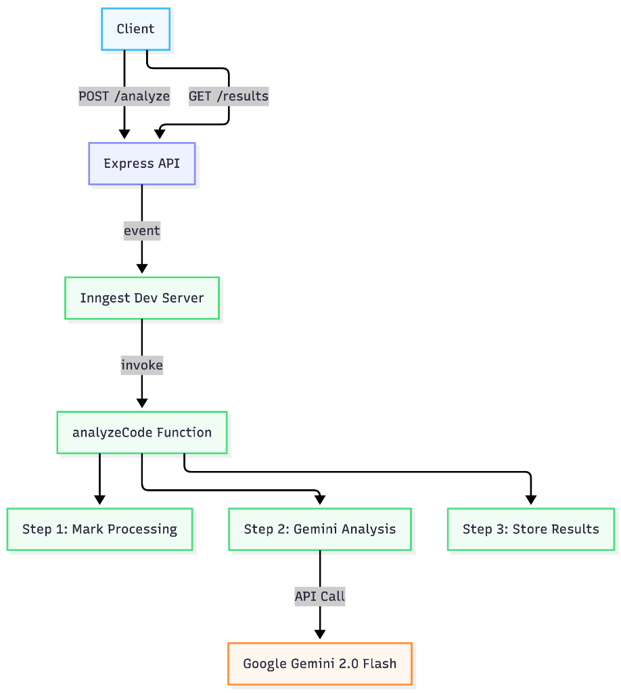

# 🛡️ SafeSnippet Analyzer — Reference Solution

> **AI-Powered Code Vulnerability Analyzer** built with Node.js, Google Gemini, and Inngest.

---

## Architecture



```
┌─────────────┐        ┌──────────────────┐        ┌────────────────┐
│             │  POST   │                  │ event  │                │
│   Client    │───────▶│  Express API     │──────▶│  Inngest Dev   │
│  (Browser/  │  202   │  (server.js)     │        │  Server        │
│   curl)     │◀───────│                  │        │                │
│             │  poll   │                  │        │                │
│             │───────▶│  GET /results    │        │                │
│             │  200   │                  │        │                │
└─────────────┘◀───────└──────────────────┘        └───────┬────────┘
                                                           │
                                                           │ invoke
                                                           ▼
                                                   ┌────────────────┐
                                                   │ analyzeCode()  │
                                                   │ Inngest Func   │
                                                   │                │
                                                   │ Step 1: Mark   │
                                                   │ Step 2: Gemini │
                                                   │ Step 3: Store  │
                                                   └───────┬────────┘
                                                           │
                                                           │ API call
                                                           ▼
                                                   ┌────────────────┐
                                                   │  Google Gemini │
                                                   │  2.0 Flash     │
                                                   └────────────────┘
```

## Project Structure

```
src/
├── server.js                  # Express API server + Inngest middleware
├── inngest/
│   ├── client.js              # Shared Inngest client instance
│   └── analyzeCode.js         # Durable AI analysis function (3 steps)
├── services/
│   └── geminiService.js       # Google Gemini API integration
├── prompts/
│   └── securityAnalysis.js    # System prompt + few-shot examples
├── utils/
│   └── jsonParser.js          # Defensive JSON parsing for LLM output
├── store/
│   └── resultsStore.js        # In-memory job results (Map-based)
├── public/
│   └── index.html             # Web UI (dark-mode, responsive)
├── test/
│   └── testAnalysis.js        # End-to-end integration test
├── package.json
├── .env.example               # Environment variable template
└── .gitignore
```

## Quick Start

### Prerequisites

- **Node.js** v18+ (check: `node --version`)
- **npm** v9+ (comes with Node.js)
- **Google Gemini API Key** — free at [ai.google.dev](https://ai.google.dev/gemini-api/docs/api-key)

### Setup

```bash
# 1. Navigate to the source directory
cd src

# 2. Install dependencies
npm install

# 3. Create your environment file
cp .env.example .env

# 4. Add your Gemini API key to .env
# Open .env and replace 'your_gemini_api_key_here' with your actual key
```

### Run

You need **two terminal windows** running simultaneously:

**Terminal 1 — Express Server:**
```bash
npm run dev
```

**Terminal 2 — Inngest Dev Server:**
```bash
npm run inngest:dev
```

### Test

**Option A — curl:**
```bash
curl -X POST http://localhost:3000/api/analyze \
  -H "Content-Type: application/json" \
  -d '{
    "code": "const query = \"SELECT * FROM users WHERE id=\" + userId; db.query(query);",
    "language": "javascript"
  }'
```

Then poll with the returned jobId:
```bash
curl http://localhost:3000/api/results/<jobId>
```

**Option B — Test script:**
```bash
node test/testAnalysis.js
```

**Option C — Web UI:**
Open [http://localhost:3000](http://localhost:3000) in your browser.

## Sample Output

```json
{
  "riskLevel": "CRITICAL",
  "vulnerabilities": [
    {
      "type": "SQL Injection",
      "severity": "CRITICAL",
      "line": 1,
      "description": "User input is directly concatenated into SQL query...",
      "recommendation": "Use parameterized queries: db.query('SELECT * FROM users WHERE id = ?', [userId])"
    }
  ],
  "summary": "This code contains a critical SQL injection vulnerability...",
  "metadata": {
    "analyzedAt": "2025-01-15T10:30:00.000Z",
    "language": "javascript",
    "linesAnalyzed": 2
  }
}
```

